# 手绘草图检索

## 项目介绍

一个基于 Flask 的手绘图像检索 Web 服务，用户可以通过绘制草图来检索数据库中的图片。项目使用了 VGG16 网络作为特征提取器，将草图和图片的特征进行比较，返回最相似的图片。

该项目在 SketchyDatabase 项目的基础上实现了人机交互界面，用户可以在网页画板绘制图像，检索结果会显示在网页上。

## 数据集

项目使用的数据集来自《[The Sketchy Database: Learning to Retrieve Badly Drawn Bunnies](https://www.cc.gatech.edu/~hays/tmp/sketchy-database.pdf)》，这是一个草图-照片配对数据库。通过让众包工人根据从125个类别中抽取的特定摄影对象进行素描，收集了12,500个对象的75,471幅素描。感谢原作者提供的数据集。

本项目只需要使用 photo 文件夹中的图片，不需要使用 sketch 文件夹中的图片。将 photo 文件夹中的分类目录放到 `data/dataset/photo-test` 目录下即可。

## 模型

项目使用的模型来自 [SketchyDatabase](https://github.com/CDOTAD/SketchyDatabase) ，此项目基于 MIT license 协议开源，是《The Sketchy Database: Learning to Retrieve Badly Drawn Bunnies》的复现。感谢原作者 **CDOTAD** 的工作和开源精神。

本项目需要使用图片数据集的特征文件。图片的特征文件需要使用 SketchyDatabase 项目的 `feature_extract.py` 提取，将提取的特征文件 `photo-vgg16.pkl` 放到 `data/feature` 目录下，然后修改 `config.py` 文件中的 `PHOTO_FEATURE` 变量即可。

本项目需要使用草图的预训练模型。模型需要使用 SketchyDatabase 项目的 `train.py` 训练，将模型 `sketchy_model.pth` 文件放到 `data/model` 目录下，然后修改 `config.py` 文件中的 `SKETCH_VGG` 变量即可。

本项目作者 Fork 了 SketchyDatabase 项目，修改了部分代码。Fork 项目地址为 [SketchyDatabase](https://github.com/HEX9CF/SketchyDatabase)。

## 网络图

### VGG16

```mermaid
graph TD
    A[输入] --> B[卷积层 Conv2d 3, 64, 3x3]
    B --> C[激活函数 ReLU]
    C --> D[卷积层 Conv2d 64, 64, 3x3]
    D --> E[激活函数 ReLU]
    E --> F[池化层 MaxPool2d 2x2]
    F --> G[卷积层 Conv2d 64, 128, 3x3]
    G --> H[激活函数 ReLU]
    H --> I[卷积层 Conv2d 128, 128, 3x3]
    I --> J[激活函数 ReLU]
    J --> K[池化层 MaxPool2d 2x2]
    K --> L[卷积层 Conv2d 128, 256, 3x3]
    L --> M[激活函数 ReLU]
    M --> N[卷积层 Conv2d 256, 256, 3x3]
    N --> O[激活函数 ReLU]
    O --> P[卷积层 Conv2d 256, 256, 3x3]
    P --> Q[激活函数 ReLU]
    Q --> R[池化层 MaxPool2d 2x2]
    R --> S[卷积层 Conv2d 256, 512, 3x3]
    S --> T[激活函数 ReLU]
    T --> U[卷积层 Conv2d 512, 512, 3x3]
    U --> V[激活函数 ReLU]
    V --> W[卷积层 Conv2d 512, 512, 3x3]
    W --> X[激活函数 ReLU]
    X --> Y[池化层 MaxPool2d 2x2]
    Y --> Z[卷积层 Conv2d 512, 512, 3x3]
    Z --> AA[激活函数 ReLU]
    AA --> AB[卷积层 Conv2d 512, 512, 3x3]
    AB --> AC[激活函数 ReLU]
    AC --> AD[卷积层 Conv2d 512, 512, 3x3]
    AD --> AE[激活函数 ReLU]
    AE --> AF[池化层 MaxPool2d 2x2]
    AF --> AG[自适应平均池化层 AdaptiveAvgPool2d 1x1]
    AG --> AH[展平 Flatten]
    AH --> AI[全连接层 Linear 512, 4096]
    AI --> AJ[激活函数 ReLU]
    AJ --> AK[Dropout]
    AK --> AL[全连接层 Linear 4096, 4096]
    AL --> AM[激活函数 ReLU]
    AM --> AN[Dropout]
    AN --> AO[全连接层 Linear 4096, 1000]
    AO --> AP[输出]
```

